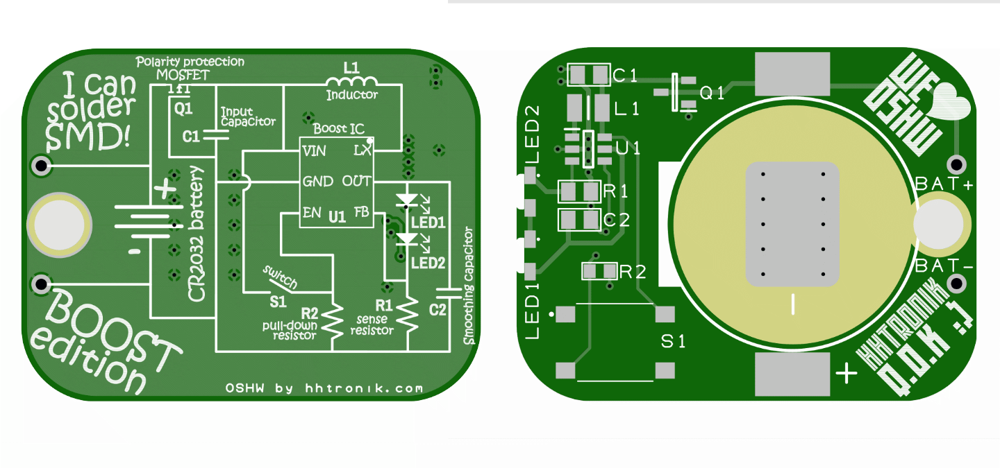
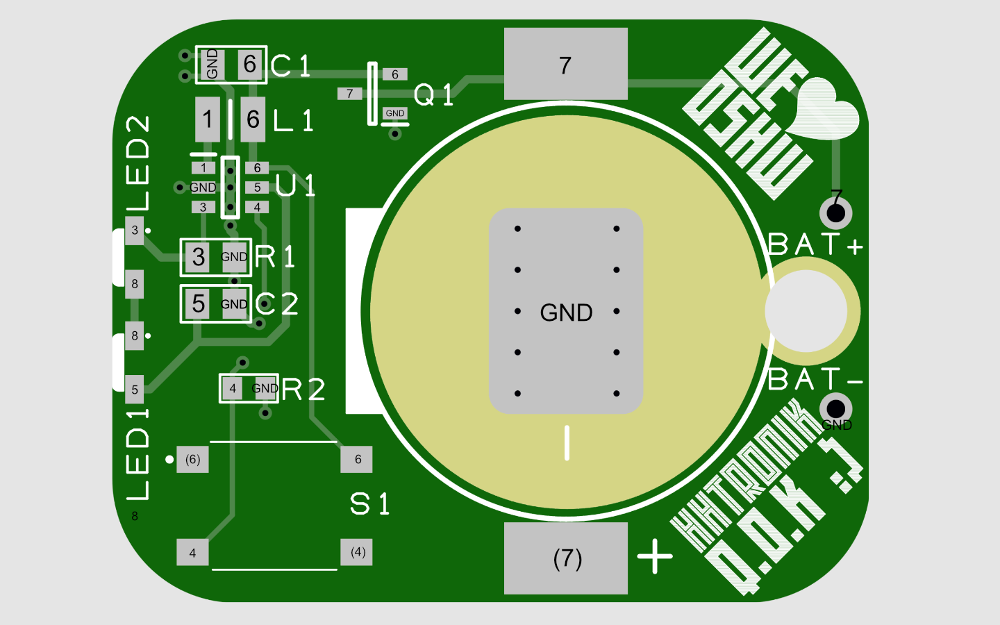

HHTronik Q.O.K. / I learn soldering SMD Boost edition
=====================================================

Want to learn soldering SMT components and four components is not a challenge for you? 
Then this is for you! **I learn soldering SMD Boost edition** is our *level-up* kit from 
the super simple [I learn soldering SMD Q.O.K.](https://github.com/hhtronik/qok-i-learn-soldering-smd). 
Slightly smaller parts, a lot more circuit to dig through and your opportunity to build one of 
the most common switch mode power supply circuits!

On this board you have two white LEDs wired up in series, which means that you'd need at about
6V accross them to light them up, yet your power source is a mere 3V (when full) coin cell. 

How this work you ask? Read below!

>
> Note, while this is not challenging or difficult by any absolute measure, soldering small parts
> like those on this circuit can be tedious when you do this first. 
>
> Have a little patience, a steady hand and LOTs of flux ;)
>

What equipement do I need?
--------------------------

- A soldering iron, preferably one with a relatively fine tip
- Some solder, again, thinner one (< 1mm) will make your life easier
- Fine tip tweezers
- Patience

As always, work safety is important, so don't burn yourself and don't inhale the fumes released while soldering. Working in a well ventilated area is good. We'd definitely recommend adding some ventilation (for example a fan of some sort blowing the fumes away from you or a proper soldering fume extractor if you plan on doing this over and over again :)

Optionally you may have these things around:

- some flux (**you should have some**)
- rubbing alcool or isopropanol
- some lint-free cloth / paper towel
- a multimeter (ideally with a diode test mode)
- a magnifying glass

Assembly mini guide
-------------------

>
> we're expecting you did already solder at least some SMD passives previously. 
> If you didn't you should really go watch all of the videos below and maybe
> give one of our simpler SMD kits a try first.
>

1. solder D1 and check (measure) you got the polarity right (it should conduct from the battery holder pad next to it to L1)
2. solder C1
3. solder R1
4. solder C2
5. solder R2
6. measure you didn't short the positive rail (behing D1) to ground (center pad of the battery holder footprint)
7. solder L1
8. solder U1 (**watch out for pin 1 marks on package and PCB to line up**) (tip: add solder to on pad and tack the IC in place, then solder the remaining pins ;)
9. check for solder bridges on U1, check polarity again!
10. solder both LEDs
11. check the polarity by using the diode test mode. 
11. solder the switch
12. solder the battery holder
12. carefully inspect and measure everything again
13. insert a CR2025 or CR2032 cell (positive terminal toucing the metal bracket of the holder)
14. cross fingers and press the button!

Did it light up? :)

Troubleshooting
----------------

Here are some things you want to check:

| Pads / Test points | Multimeter mode       | Expected result            | Repairing it               |
| ------------------ | --------------------- | -------------------------- | -------------------------- |
| `6` to `GND`       | `resistance`          | >500 KOhm                  | check for solder bridges around U1 and C1 |
| `1` to `GND`       | `resistance`          | >500 KOhm                  | check for solder bridges around U1 and C1 |
| `3` to `GND`       | `resistance`          | ~100Ohm                    | check R1 |
| `7` to `6`         | `diode test`          | With the positive terminal on `7` and COM/Negative on `6` D1 should conduct. | Fix polarity of D1 |
| `5` to `8`         | `diode test`          | With the positive terminal on `5` and COM/Negative on `8` LED1 should light up. | Fix polarity of LED1 |
| `8` to `3`         | `diode test`          | With the positive terminal on `8` and COM/Negative on `3` LED2 should light up. | Fix polarity of LED2 |
| `4` to `GND`       | `resistance`          | 400KOhm < x < 1MOhm        | check the solder joints on U1, R2, S1 and the orientation of S1
| `4` to `6`         | `continuity`          | Open circuit when S1 **is not pressed** | check the orientation of S1
| `4` to `6`         | `continuity`          | Continuity when S1 **is pressed** | check the orientation of S1
| `4` to `6`         | `continuity`          | Continuity when S1 **is pressed** | check the orientation of S1

Orientation of components:

- U1 has a PIN1 mark on its case (small dot) which should align with the `pad 1` in the image above
- D1 has a cathode mark (two lines engraved in case) which should be facing `pad 6`
- LED1 has a green cathode mark on its side which should line up with `pad 8` (dot mark on silkscreen)
- LED2 has a green cathode mark on its side which should line up with `pad 3` (dot mark on silkscreen)

Polarity of SMT parts
---------------------

About half the components on this PCB are polarized, meaning that their orientation matters
for them to function properly. Difference components have very different markings on their
case to show their orientation.

As these markings are often engraved into the case using a laser, they can be difficult to
read thus our recommendation you get some magnifying glass.

`TODO: pictures of the actual components and footprints on the PCB`

Components
----------

| Ref. | Part                        | Notes / Alternative parts  |
| ---- | --------------------------- | -------------------------- |
| D1   | `Diodes Inc. 1N5819HW1`     | `MBR0520LT1G` or any other SOD123 Schottky diode with If > 500mA and low Vf
| L1   | `TDK VLS252012HBU-220M`     | `Murata LQH2HPZ220MJRL` / 22uH 2.5x2.0mm inductor
| U1   | `Hexin  HX3001`             | `Chipown AP2000ATCER` / Current mode step up converter SOT23-6
| C1   | `Samsung CL21A106KPFNNNF`   | 10uF 0805 X5R 10V MLC capacitor
| C2   | `Samsung CL21B474KAFNNNE`   | 470nF 0805 X7R 25V MLC capacitor
| R1   | `Panasonic ERJ-6ENF51R1V`   | 51 Ohm 0805 1% resistor
| R2   | `Panasonic ERJ-3GEYJ105V`   | 1 MOhm 0603 5% resistor
| LED1 | `Inolux IN-S126ASUW`        | Side view white LED If = 20mA 
| LED2 | `Inolux IN-S126ASUW`        | Side view white LED If = 20mA
| S1   | `C&K PTS645SL50SMTR92`      | Many surface mount tactile switches with a 6x6mm outline
| BAT1 | `Keystone Electronics 3034` | `Linx Technologies BAT-HLD-001` or `MPD BK-912-TR` or `Q&J WJ-CR2032-1-W`

I don't know anything about electronics, what can I learn?
----------------------------------------------------------

Besides soldering technique we'd say:

- what a boost/step-up converter is and how it works
- why some of the components were chosen

Watch others do
---------------

Some SMT soldering tutorials worth watching if you've never done this before

[LeoMakes / How to solder surface mount parts (it's easy!) ~ 19min](https://www.youtube.com/watch?v=f9fbqks3BS8)

[Collin's Lab / Surface Mount Soldering ~ 8min](https://www.youtube.com/watch?v=QzoPxvIM2qE)

[Tomislav Darlic / Soldering 1206 resistor ~ 2min](https://www.youtube.com/watch?v=_DsCdOaRUPM)

LICENCE
-------

This project is licenced under CERN Open Hardware Licence Version 2 - Strongly Reciprocal see LICENCE file for the full text.